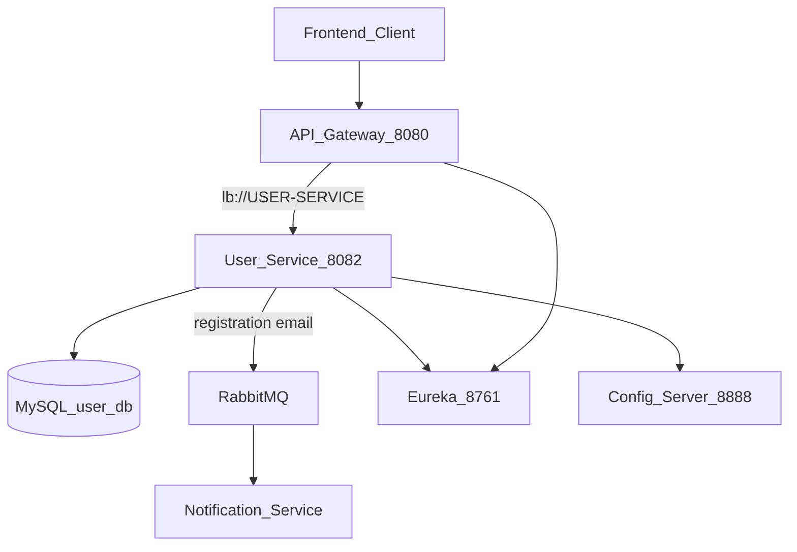
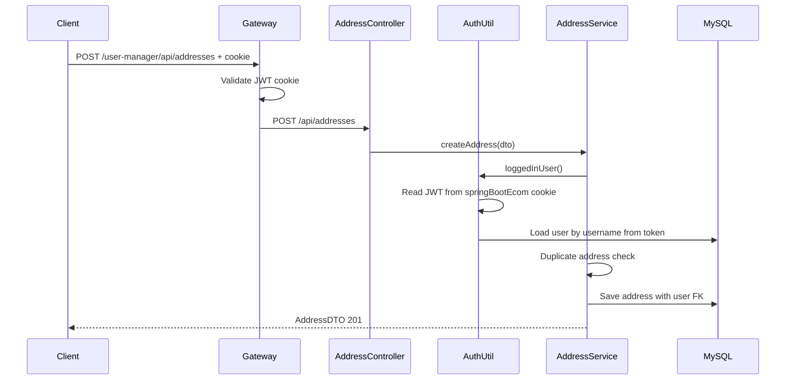
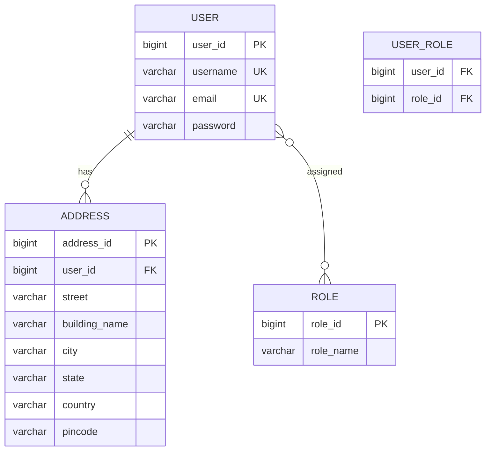
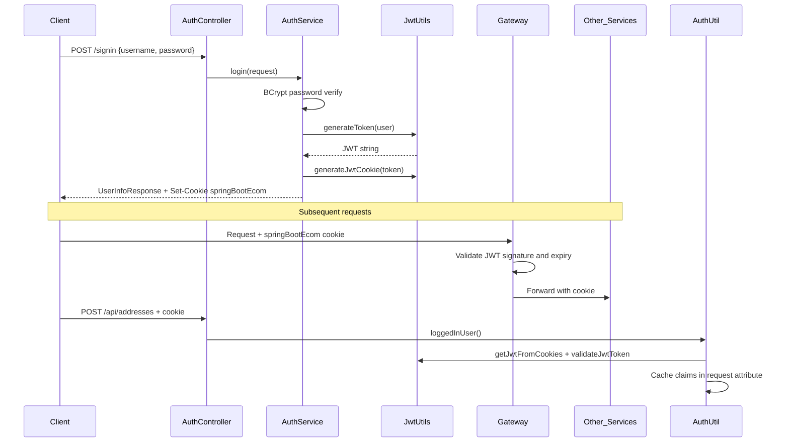
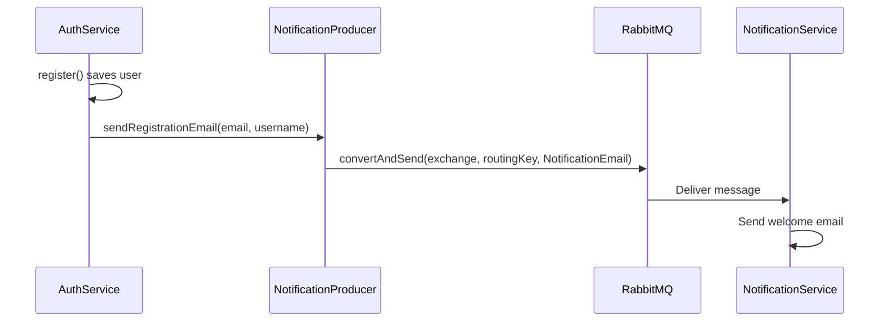
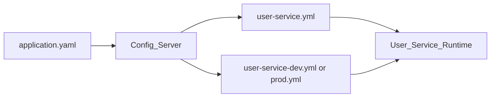

# User Service — Architecture Documentation

This document describes the full architecture of the **User Service** microservice in the Laptopshop e-commerce backend. For monorepo-wide context (gateway routing, all services, deployment), see [backend/README.md](../../README.md).

---

## Table of Contents

1. [Service Overview](#1-service-overview)
2. [System Context](#2-system-context)
3. [Internal Layered Architecture](#3-internal-layered-architecture)
4. [Data Model](#4-data-model)
5. [REST API Reference](#5-rest-api-reference)
6. [Authentication & Authorization](#6-authentication--authorization)
7. [Async Integration — RabbitMQ](#7-async-integration--rabbitmq)
8. [Configuration](#8-configuration)
9. [Startup Seed Data](#9-startup-seed-data)
10. [Exception Handling](#10-exception-handling)
11. [Deployment & Dependencies](#11-deployment--dependencies)
12. [Design Notes & Known Trade-offs](#12-design-notes--known-trade-offs)
13. [Cross-References](#13-cross-references)

---

## 1. Service Overview

| Property | Value |
|----------|-------|
| **Service name** | `user-service` |
| **Eureka registration** | `USER-SERVICE` |
| **Port** | `8082` |
| **Gateway prefix** | `/user-manager/**` (rewritten to `/**` before forwarding) |
| **Framework** | Spring Boot 3.5.7, Java 21 |
| **Database** | MySQL (dedicated schema in dev; shared `ecommerce` in prod) |

### Responsibilities

The User Service is the **identity and profile** microservice. It handles:

- **Authentication** — user registration, login, logout
- **JWT issuance** — creates HS256 tokens stored in an HTTP cookie
- **User management** — paginated listing and deletion of customers/sellers
- **Address management** — CRUD for shipping addresses linked to users
- **Event publishing** — sends welcome email messages to RabbitMQ on registration

The service does **not** make direct HTTP calls to other microservices. Downstream services (order-service, product-service) validate the same JWT independently using a shared secret.

---

## 2. System Context



### External Dependencies

| Dependency | Purpose | Required at startup |
|------------|---------|---------------------|
| **API Gateway** (`:8080`) | Single entry point; JWT validation for protected routes | No (service runs standalone) |
| **Config Server** (`:8888`) | Externalized configuration (JWT, DB, Eureka) | Optional (`optional:configserver:`) |
| **Eureka** (`:8761`) | Service discovery; gateway resolves `lb://USER-SERVICE` | Yes (dev/prod profiles) |
| **MySQL** | Persistent storage for users, roles, addresses | Yes |
| **RabbitMQ** | Async welcome email on signup | Yes (signup succeeds without it, but email fails silently) |
| **Notification Service** | Consumes RabbitMQ messages and sends email | No (producer-only from user-service) |

---

## 3. Internal Layered Architecture

### Package Structure

```
user-service/src/main/java/com/ecommerce/user_service/
├── UserServiceApplication.java       # Spring Boot entry point
├── controller/                       # REST layer
│   ├── AuthController.java
│   └── AddressController.java
├── service/                          # Business logic
│   ├── AuthService.java / AuthServiceImpl.java
│   ├── AddressService.java / AddressServiceImpl.java
│   └── NotificationProducer.java
├── repositories/                     # Spring Data JPA
│   ├── UserRepository.java
│   ├── AddressRepository.java
│   └── RoleRepository.java
├── model/                            # JPA entities
│   ├── User.java
│   ├── Address.java
│   ├── Role.java
│   └── AppRole.java
├── payload/                          # DTOs and wrappers
├── security/
│   ├── SecurityConfig.java
│   ├── jwt/JwtUtils.java
│   ├── request/                      # LoginRequest, SignupRequest
│   └── response/                     # UserInfoResponse, MessageResponse
├── config/                           # Spring beans
│   ├── UserServiceConfig.java        # PasswordEncoder + seed data
│   ├── AppConfig.java                # ModelMapper
│   ├── RabbitMQConfig.java
│   ├── SwaggerConfig.java
│   ├── WebMvcConfig.java
│   └── AppConstants.java
├── exceptions/                       # Custom exceptions + global handler
└── util/AuthUtil.java                # Cookie-based JWT → current user
```

### Layer Responsibilities

| Layer | Key classes | Responsibility |
|-------|-------------|----------------|
| **Controller** | `AuthController`, `AddressController` | HTTP mapping, validation, response shaping |
| **Service** | `AuthServiceImpl`, `AddressServiceImpl`, `NotificationProducer` | Business rules, JWT/cookie handling, messaging |
| **Repository** | `UserRepository`, `AddressRepository`, `RoleRepository` | Database access via Spring Data JPA |
| **Domain** | `User`, `Address`, `Role`, `AppRole` | JPA entities and role enum |
| **Security** | `JwtUtils`, `SecurityConfig`, `AuthUtil` | Token creation/validation; manual auth (no JWT filter) |
| **Config** | `UserServiceConfig`, `RabbitMQConfig`, etc. | Beans, startup seeding, OpenAPI, messaging |
| **Cross-cutting** | `MyGlobalExceptionHandler` | Centralized error responses |

### Request Flow — Create Address



---

## 4. Data Model

### Entity-Relationship Diagram



### Tables

#### `user`

| Column | Type | Constraints |
|--------|------|-------------|
| `user_id` | BIGINT | Primary key, auto-increment |
| `username` | VARCHAR(20) | Not blank, unique |
| `email` | VARCHAR(50) | Not blank, unique, valid email |
| `password` | VARCHAR(120) | Not blank, BCrypt-encoded |

#### `role`

| Column | Type | Constraints |
|--------|------|-------------|
| `role_id` | BIGINT | Primary key, auto-increment |
| `role_name` | VARCHAR | Enum: `ROLE_USER`, `ROLE_SELLER`, `ROLE_ADMIN` |

#### `user_role` (join table)

Many-to-many between `user` and `role`. Fetched **EAGER** on `User.roles`. Cascade: `MERGE` only.

#### `address`

| Column | Type | Constraints |
|--------|------|-------------|
| `address_id` | BIGINT | Primary key, auto-increment |
| `user_id` | BIGINT | Foreign key → `user` |
| `street` | VARCHAR | Min 5 characters |
| `building_name` | VARCHAR | Min 5 characters |
| `city` | VARCHAR | Min 4 characters |
| `state` | VARCHAR | Min 2 characters |
| `country` | VARCHAR | Min 2 characters |
| `pincode` | VARCHAR | Min 6 characters |

### Relationships & Cascade Rules

- **User ↔ Role**: `@ManyToMany` via `user_role`; roles loaded eagerly on every user fetch
- **User → Address**: `@OneToMany(mappedBy = "user")` with `CascadeType.PERSIST, MERGE` and `orphanRemoval = true`
- **Address → User**: `@ManyToOne` with `@JoinColumn(name = "user_id")`

JPA schema management: `spring.jpa.hibernate.ddl-auto: update` (from config-server).

---

## 5. REST API Reference

All endpoints are accessed through the API Gateway at `:8080` with the `/user-manager` prefix. Internal service paths omit the prefix.

### Authentication — `AuthController`

Base path: `/api/auth` → Gateway: `/user-manager/api/auth`

| Method | Gateway path | Service path | Auth | Description |
|--------|--------------|--------------|------|-------------|
| `POST` | `/user-manager/api/auth/signin` | `/api/auth/signin` | Public | Log in; returns `UserInfoResponse` and sets JWT cookie |
| `POST` | `/user-manager/api/auth/signup` | `/api/auth/signup` | Public | Register; sends welcome email via RabbitMQ |
| `GET` | `/user-manager/api/auth/username` | `/api/auth/username` | Cookie* | Returns current username from JWT |
| `GET` | `/user-manager/api/auth/user` | `/api/auth/user` | Cookie* | Returns current user id, username, roles |
| `POST` | `/user-manager/api/auth/signout` | `/api/auth/signout` | Cookie* | Clears JWT cookie |
| `GET` | `/user-manager/api/auth/sellers` | `/api/auth/sellers` | Public† | Paginated seller list (`pageNumber`, default 0) |
| `GET` | `/user-manager/api/auth/customers` | `/api/auth/customers` | Public† | Paginated customer list |
| `DELETE` | `/user-manager/api/auth/customers/{userId}` | `/api/auth/customers/{userId}` | Public† | Delete customer (ROLE_USER only) |
| `DELETE` | `/user-manager/api/auth/sellers/{userId}` | `/api/auth/sellers/{userId}` | Public† | Delete seller (not if also admin) |

\* Gateway marks `/user-manager/api/auth/**` as public; these endpoints validate the JWT cookie internally when called.

† Admin-style operations with no gateway role enforcement.

#### Request / Response DTOs — Auth

| DTO | Package | Fields |
|-----|---------|--------|
| `LoginRequest` | `security.request` | `username`, `password` (both `@NotBlank`) |
| `SignupRequest` | `security.request` | `username` (3–20), `email`, `password` (6–40), optional `roles` set |
| `UserInfoResponse` | `security.response` | `id`, `jwtToken`, `username`, `email`, `roles` |
| `MessageResponse` | `security.response` | `message` |
| `UserDTO` | `payload` | `userId`, `username`, `email`, `password`, `roles` |
| `UserResponse` | `payload` | Paginated: `content`, `pageNumber`, `pageSize`, `totalElements`, `totalPages`, `lastPage` |

Pagination defaults (from `AppConstants`): page `0`, size `5`, sort by `userId` descending.

### Addresses — `AddressController`

Base path: `/api` → Gateway: `/user-manager/api`

| Method | Gateway path | Service path | Auth | Description |
|--------|--------------|--------------|------|-------------|
| `POST` | `/user-manager/api/addresses` | `/api/addresses` | Cookie | Create address for logged-in user (201) |
| `GET` | `/user-manager/api/addresses` | `/api/addresses` | Cookie | List all addresses in database |
| `GET` | `/user-manager/api/addresses/{addressId}` | `/api/addresses/{addressId}` | Cookie | Get address by ID |
| `GET` | `/user-manager/api/users/addresses` | `/api/users/addresses` | Cookie | Addresses of logged-in user only |
| `PUT` | `/user-manager/api/addresses/{addressId}` | `/api/addresses/{addressId}` | Cookie | Update address fields |
| `DELETE` | `/user-manager/api/addresses/{addressId}` | `/api/addresses/{addressId}` | Cookie | Delete address; returns deleted DTO |

#### Request / Response DTOs — Address

| DTO | Fields |
|-----|--------|
| `AddressDTO` | `addressId`, `street`, `buildingName`, `city`, `state`, `country`, `pincode` |

#### Business Rules — Address

- **Create**: Requires valid JWT cookie; rejects duplicate addresses (same street, building, city, state, pincode for the user)
- **Get user addresses**: Returns empty list if user has none (no error)
- **Get all addresses**: Throws `APIException` if database is empty
- **Update / Delete**: No ownership verification — any authenticated user can modify any address by ID

---

## 6. Authentication & Authorization

### JWT Model

The User Service is the **token issuer** for the entire platform. All services share the same HMAC-SHA secret (`spring.app.jwtSecret`).

| Property | Value | Source |
|----------|-------|--------|
| Algorithm | HS256 (HMAC-SHA) | `JwtUtils` |
| Cookie name | `springBootEcom` | `spring.ecom.app.jwtCookieName` |
| Token expiration | 3,000,000 ms (~50 min) | `spring.app.jwtExpirationMs` |
| Cookie max age | 24 hours | `JwtUtils.generateJwtCookie()` |
| Cookie flags | `httpOnly=false`, `secure=false` | `JwtUtils` |

#### JWT Claims

| Claim | Content |
|-------|---------|
| `sub` | Username |
| `userId` | Numeric user ID |
| `email` | User email |
| `roles` | List of role names (e.g. `["ROLE_USER"]`) |

### JWT Lifecycle



### Authorization Model — Dual Enforcement

Authorization is split between the **API Gateway** and **application-level** checks:

| Layer | Mechanism | Scope |
|-------|-----------|-------|
| **API Gateway** | JWT cookie validation + role mappings | Non-public paths; role patterns like `/user-manager/api/admin/**` |
| **Spring Security** | `SecurityConfig` — `permitAll()` for all routes | Effectively disabled |
| **Application** | `AuthUtil` (addresses), `AuthServiceImpl` (login/user details) | Manual JWT cookie parsing |

#### Gateway Public Paths (relevant to user-service)

From `api-gateway/src/main/resources/application.yaml`:

- `/user-manager/api/auth/**` — all auth endpoints, including admin list/delete
- `/user-manager/v3/api-docs/**` — OpenAPI docs

#### Gateway Role Mappings (user-service)

| Pattern | Required role |
|---------|---------------|
| `/user-manager/api/admin/**` | `ROLE_ADMIN` |

No controller endpoints currently use the `/api/admin/**` path; admin operations live under `/api/auth/**` instead.

### Role Assignment at Signup

| Requested role string | Assigned `AppRole` |
|-----------------------|-------------------|
| `"user"` or default (empty) | `ROLE_USER` |
| `"seller"` | `ROLE_SELLER` |
| `"admin"` | `ROLE_ADMIN` |

Multiple roles can be requested in a single signup request.

### Password Storage

- **Encoder**: `BCryptPasswordEncoder` (bean in `UserServiceConfig`)
- Passwords are never returned in API responses (except `UserDTO` mapping which may include the hash — used in admin list views)

---

## 7. Async Integration — RabbitMQ

### Registration Email Flow



### Configuration

From `user-service/src/main/resources/application.yaml`:

| Property | Value |
|----------|-------|
| Exchange | `notification-exchange` |
| Routing key | `notification-routing-key` |
| Queue name (reference) | `notification-queue` |

### Message Payload — `NotificationEmail`

| Field | Example |
|-------|---------|
| `recipient` | User's email |
| `subject` | `"Welcome to Laptop Ecommerce"` |
| `msgBody` | `"Hi {username}, welcome to our store! ..."` |

### Producer Class

`NotificationProducer` uses `RabbitTemplate` with a Jackson JSON message converter (configured in `RabbitMQConfig`). The user-service is **producer-only**; the notification-service consumes and sends the actual email.

---

## 8. Configuration

### Three-Tier Config Model



### Config Sources

| Source | File | Key settings |
|--------|------|--------------|
| **Local bootstrap** | `src/main/resources/application.yaml` | App name, active profile, config-server import, RabbitMQ queue names |
| **Shared** | `config-server/.../user-service.yml` | JPA `ddl-auto: update`, JWT secret/expiration, cookie name, port 8082, springdoc |
| **Dev profile** | `config-server/.../user-service-dev.yml` | MySQL `laptop_ecommerce_graduation_project_user_service`, Eureka localhost, RabbitMQ localhost, frontend URL |
| **Prod profile** | `config-server/.../user-service-prod.yml` | MySQL `ecommerce`, Docker hostnames (`mysql`, `rabbitmq`, `discovery-service`), springdoc disabled |

### Environment Variables

| Variable | Default | Purpose |
|----------|---------|---------|
| `SPRING_PROFILES_ACTIVE` | `dev` | Selects dev or prod config profile |
| `CONFIG_SERVER_URL` | `http://localhost:8888` | Config server address |
| `FRONTEND_URL` | `http://localhost:5173` | CORS / frontend reference (prod) |

### Database URLs

| Profile | JDBC URL |
|---------|----------|
| **dev** | `jdbc:mysql://localhost:3306/laptop_ecommerce_graduation_project_user_service?serverTimezone=UTC&createDatabaseIfNotExist=true` |
| **prod** | `jdbc:mysql://mysql:3306/ecommerce?createDatabaseIfNotExist=true` |

---

## 9. Startup Seed Data

On application startup, `UserServiceConfig` runs a `CommandLineRunner` that seeds roles and demo users if they do not already exist.

### Roles

| Role name | Enum value |
|-----------|------------|
| User | `ROLE_USER` |
| Seller | `ROLE_SELLER` |
| Admin | `ROLE_ADMIN` |

### Demo Users

| Username | Email | Password | Roles |
|----------|-------|----------|-------|
| `user1` | user1@example.com | `password1` | `ROLE_USER` |
| `user2` | user2@example.com | `password1` | `ROLE_USER` |
| `seller1` | seller1@example.com | `password2` | `ROLE_SELLER` |
| `admin` | admin@example.com | `adminPass` | `ROLE_USER`, `ROLE_SELLER`, `ROLE_ADMIN` |

---

## 10. Exception Handling

Global handler: `MyGlobalExceptionHandler` (`@RestControllerAdvice`)

| Exception | HTTP Status | Response shape |
|-----------|-------------|----------------|
| `MethodArgumentNotValidException` | 400 Bad Request | `Map<fieldName, message>` |
| `ResourceNotFoundException` | 404 Not Found | `APIResponse(message, status=false)` |
| `APIException` | 400 Bad Request | `APIResponse(message, status=false)` |

### Unhandled Exceptions

These are **not** caught by the global handler and propagate as Spring default error responses:

| Exception | Typical cause | HTTP status |
|-----------|---------------|-------------|
| `ResponseStatusException` | Invalid login credentials; missing/invalid JWT on `/auth/user` or `/auth/username` | 404 or 401 |
| `UsernameNotFoundException` | Missing or invalid JWT cookie on address endpoints | 500 (default) |
| `RuntimeException` | Role not found during signup | 500 |

### Custom Exception Classes

| Class | Purpose | Used? |
|-------|---------|-------|
| `APIException` | Business rule violations | Yes |
| `ResourceNotFoundException` | Entity not found | Yes |
| `EmptyArrayException` | Empty result sets | Defined but unused |

---

## 11. Deployment & Dependencies

### Docker

Multi-stage build in `user-service/Dockerfile`:

1. **Builder stage**: OpenJDK 21 Ubuntu — downloads dependencies, runs `./mvnw clean package -DskipTests`
2. **Runtime stage**: OpenJDK 21 Ubuntu — copies JAR, exposes port **8082**

### Maven Dependencies

| Dependency | Purpose |
|------------|---------|
| `spring-cloud-starter-netflix-eureka-client` | Service discovery |
| `spring-cloud-starter-config` | External configuration |
| `spring-boot-starter-data-jpa` | Persistence |
| `spring-boot-starter-amqp` | RabbitMQ |
| `spring-boot-starter-security` | Security framework (permit-all config) |
| `spring-boot-starter-validation` | Bean validation |
| `spring-boot-starter-web` | REST API |
| `jjwt-api/impl/jackson` (0.13.0) | JWT creation and validation |
| `mysql-connector-j` | MySQL driver |
| `modelmapper` (3.2.4) | Entity ↔ DTO mapping |
| `springdoc-openapi-starter-webmvc-ui` (2.8.13) | Swagger / OpenAPI |
| `lombok` | Boilerplate reduction |

### Local Development Prerequisites

Start these before running user-service:

1. **Config Server** — `:8888`
2. **Eureka (Discovery Service)** — `:8761`
3. **MySQL** — dev database on `:3306`
4. **RabbitMQ** — `:5672` (for welcome emails)

Run the service:

```bash
cd user-service
./mvnw spring-boot:run
```

Or via Docker (requires built JAR and network with other services).

### Swagger / OpenAPI

| Environment | Access |
|-------------|--------|
| **dev** | `http://localhost:8080/user-manager/swagger-ui.html` (via gateway) |
| **prod** | Disabled (`springdoc.api-docs.enabled: false`) |

OpenAPI is configured with a Bearer JWT security scheme in `SwaggerConfig`, though the runtime auth mechanism is cookie-based.

### Tests

Only a context-load smoke test exists: `UserServiceApplicationTests.contextLoads()`. No unit or integration tests for JWT, auth flows, or address CRUD.

---

## 12. Design Notes & Known Trade-offs

These are intentional or emergent design choices worth documenting for architecture review:

### 1. Symmetric JWT Secret Across All Services

The user-service **creates** tokens; the gateway and downstream services **validate** them using the same HMAC secret. This avoids OAuth2/RS256 complexity but means any service with the secret can forge tokens. A more secure approach would use RS256 where only user-service holds the private key.

### 2. Cookie-Based JWT (`httpOnly=false`)

Tokens are stored in a readable cookie (`springBootEcom`), not an `Authorization: Bearer` header. This simplifies browser-based auth but exposes tokens to XSS if the frontend has script injection vulnerabilities. `httpOnly=true` would mitigate this.

### 3. Spring Security Effectively Disabled

`SecurityConfig` permits all requests. Authorization is ad hoc via `AuthUtil` and manual JWT checks in service methods. There are no `@PreAuthorize` annotations or a JWT authentication filter.

### 4. Address Ownership Not Enforced on Update/Delete

`updateAddress` and `deleteAddress` operate on any address ID without verifying the logged-in user owns that address. Only `createAddress` and `getAddressesByLoggedInUser` scope data to the current user.

### 5. Admin Endpoints Under Public Gateway Path

List/delete customers and sellers live under `/api/auth/**`, which the gateway marks as **public**. No role check occurs at the gateway or Spring Security level for these operations.

### 6. No Token Revocation on Signout

Signout clears the client cookie but does not invalidate the JWT server-side. The token remains valid until expiration (~50 min). There is no token blacklist or refresh-token rotation.

### 7. Eager Role Fetching

`User.roles` uses `FetchType.EAGER`, which loads roles on every user query. This is simple but can cause performance issues at scale (N+1 on role joins).

### 8. Minimal Test Coverage

Only a Spring context-load test exists. Critical paths (login, signup, JWT validation, address CRUD, delete role guards) are untested.

---

## 13. Cross-References

| Resource | Location | Content |
|----------|----------|---------|
| **Backend README** | [backend/README.md](../../README.md) | Monorepo architecture, gateway routing, JWT model, full API tables for all services |
| **API Gateway config** | [api-gateway/src/main/resources/application.yaml](../../api-gateway/src/main/resources/application.yaml) | Routes, CORS, public paths, role mappings |
| **Config Server — shared** | [config-server/src/main/resources/config/user-service.yml](../../config-server/src/main/resources/config/user-service.yml) | JWT, port, JPA |
| **Config Server — dev** | [config-server/src/main/resources/config/user-service-dev.yml](../../config-server/src/main/resources/config/user-service-dev.yml) | Dev database, Eureka, RabbitMQ |
| **Config Server — prod** | [config-server/src/main/resources/config/user-service-prod.yml](../../config-server/src/main/resources/config/user-service-prod.yml) | Prod database, Docker hostnames |
| **Swagger UI (dev)** | `http://localhost:8080/user-manager/swagger-ui.html` | Interactive API documentation |
